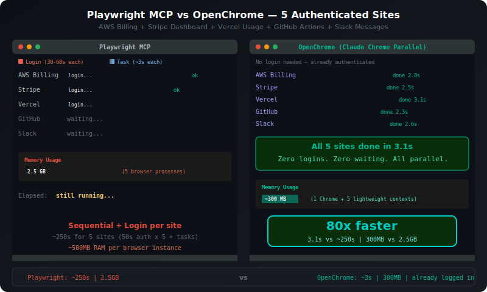

<p align="center">
  
</p>

<h1 align="center">OpenChrome</h1>

<p align="center">
  <b>Smart. Fast. Parallel.</b><br>
  Browser automation MCP server that uses your real Chrome.
</p>

<p align="center">
  <a href="https://github.com/shaun0927/openchrome/releases"></a>
  <a href="https://www.npmjs.com/package/openchrome"></a>
  <a href="https://opensource.org/licenses/MIT"></a>
</p>

<p align="center">
  
</p>

---

## What is OpenChrome?

Imagine **20+ parallel Playwright sessions** — but already logged in to everything, invisible to bot detection, and sharing one Chrome process at 300MB. That's OpenChrome.

Search across 20 sites simultaneously. Crawl authenticated dashboards in seconds. Debug production UIs with real user sessions. Connect to [OpenClaw](https://github.com/openclaw/openclaw) and give your AI agent browser superpowers across Telegram, Discord, or any chat platform.

```
You: oc screenshot my AWS billing and Stripe dashboard
AI:  [2 parallel workers, 2.1s — both done. Already logged in.]
```

| | Traditional | OpenChrome |
|---|:---:|:---:|
| **5-site task** | ~250s (login each) | **~3s** (parallel) |
| **Memory** | ~2.5 GB (5 browsers) | **~300 MB** (1 Chrome) |
| **Auth** | Every time | **Never** |
| **Bot detection** | Flagged | **Invisible** |

---

## Quick Start

```bash
npx openchrome setup
```

That's it. Say `oc` to your AI agent.

<details>
<summary>Manual config</summary>

**Claude Code:**
```bash
claude mcp add openchrome -- npx -y openchrome serve --auto-launch
```

**VS Code / Copilot** (`.vscode/mcp.json`):
```json
{
  "servers": {
    "openchrome": {
      "type": "stdio",
      "command": "npx",
      "args": ["-y", "openchrome", "serve", "--auto-launch"]
    }
  }
}
```

**Cursor / Windsurf / Other MCP clients:**
```json
{
  "mcpServers": {
    "openchrome": {
      "command": "npx",
      "args": ["-y", "openchrome", "serve", "--auto-launch"]
    }
  }
}
```

</details>

---

## How It Works

```
Traditional:  [blank browser] → login → 2FA → wait → task → close  (per site)
OpenChrome:   [your Chrome]   → task                                 (done)
```

OpenChrome connects to your running Chrome via CDP. You're already logged in. Workers run in parallel with isolated contexts (separate cookies, sessions). One Chrome process, 20+ simultaneous sessions, ~300MB total.

---

## Examples

**Parallel monitoring:**
```
oc screenshot AWS billing, GCP console, Stripe, and Datadog — all at once
→ 4 workers, 3.1s, already authenticated everywhere
```

**Multi-account:**
```
oc check orders on personal and business Amazon accounts simultaneously
→ 2 workers, isolated sessions, same site different accounts
```

**Competitive intelligence:**
```
oc compare prices for "AirPods Pro" across Amazon, eBay, Walmart, Best Buy
→ 4 workers, 4 sites, 2.4s, works past bot detection
```

---

## 47 Tools

| Category | Tools |
|----------|-------|
| **Navigate & Interact** | `navigate`, `click_element`, `fill_form`, `wait_and_click`, `find`, `computer` |
| **Read & Extract** | `read_page`, `page_content`, `javascript_tool`, `selector_query`, `xpath_query` |
| **Environment** | `emulate_device`, `geolocation`, `user_agent`, `network` |
| **Storage & Debug** | `cookies`, `storage`, `console_capture`, `performance_metrics`, `request_intercept` |
| **Parallel Workflows** | `workflow_init`, `workflow_collect`, `worker_create`, `batch_execute` |
| **Memory** | `memory_record`, `memory_query`, `memory_validate` |

<details>
<summary>Full tool list (47)</summary>

`navigate` `computer` `read_page` `find` `click_element` `wait_and_click` `form_input` `fill_form` `javascript_tool` `page_reload` `page_content` `page_pdf` `wait_for` `user_agent` `geolocation` `emulate_device` `network` `selector_query` `xpath_query` `cookies` `storage` `console_capture` `performance_metrics` `request_intercept` `drag_drop` `file_upload` `http_auth` `worker_create` `worker_list` `worker_update` `worker_complete` `worker_delete` `tabs_create_mcp` `tabs_context_mcp` `tabs_close` `workflow_init` `workflow_status` `workflow_collect` `workflow_collect_partial` `workflow_cleanup` `execute_plan` `batch_execute` `lightweight_scroll` `memory_record` `memory_query` `memory_validate` `oc_stop`

</details>

---

## CLI

```bash
oc setup                    # Auto-configure
oc serve --auto-launch      # Start server
oc serve --headless-shell   # Headless mode
oc doctor                   # Diagnose issues
```

---

## Cross-Platform

| Platform | Status |
|----------|--------|
| **macOS** | Full support |
| **Windows** | Full support (taskkill process cleanup) |
| **Linux** | Full support (Snap paths, `CHROME_PATH` env, `--no-sandbox` for CI) |

---

## Development

```bash
git clone https://github.com/shaun0927/openchrome.git
cd openchrome
npm install && npm run build && npm test
```

## License

MIT
